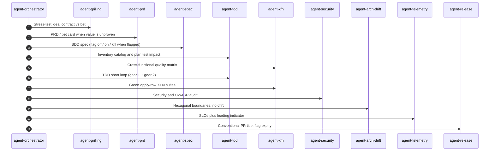
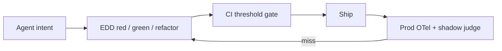

# Waykit

**Grill, spec, TDD, ship, then learn.**

Coding agents skip spec, test impact and a release bar. Waykit is that lifecycle plus the loops that feed the next session: grilling, spec, TDD, cross-functional quality, audit, telemetry and release. Eval-driven development (**alpha**) is one of those loops, when the change is a prompt or a tool contract.

[](./.github/workflows/ci.yml)
[](./docs/lifecycle.md)
[](https://waykit.dev/)
[](./LICENSE)
[](https://github.com/mzworthington/waykit/releases)

The CLI is `wk`.

## Install

```bash
curl -fsSL https://raw.githubusercontent.com/mzworthington/waykit/main/install.sh | sh
wk init . --mcp default --hook
```

macOS / Linux; needs git and Node 22+. Already cloned this repo? Run `./install.sh` from the checkout. If `wk` is not found, add `~/.local/bin` to `PATH`.

---

## What do I use this for today?

| Job in front of you | Do this |
| :--- | :--- |
| Never installed Waykit | [Install](#install), then [start here in 10 minutes](https://waykit.dev/docs/start) |
| Typo, bug, or failed job | `agent-debug` + light XFN if UI/auth/SLO. `wk debug-board <project> "<symptom>"`. Not grill → spec. |
| Starting a product feature | Orchestrator lifecycle (grill → PRD if bet → stories → spec → TDD + XFN → audit → release → confirm/kill) |
| Always-on rules are too fat | `wk measure-context` then `wk check` |
| Owned repos missing README / license / templates | `wk doctor --owned --scan <dev-dir>` |
| App repo drifted from the Waykit handshake | `wk align .` (`--write` fills host pointers; `wk mcp default --project` for kit MCP). Fleet: `wk align --owned --scan <dev-dir>`. Product PRs can call the reusable [align-consumer](./docs/align.md#consumer-ci) workflow. |
| Which kit am I running? | `wk version` (`--check` warns if origin is weeks ahead; does not pull) |
| Agent picked the wrong tool / made-up args | Write a JSONL case → `wk eval run --suite evals/edd/demo.yaml --model scripted` |
| Gate a prompt or schema change | `wk eval ci --suite evals/edd/demo.yaml --threshold-routing 95 --out out/reports` |
| Promote a prod miss into the suite | `wk eval shadow --infile evals/edd/examples/prod-turns.jsonl --sample 1 --seed 1 --out out/shadow-fails.jsonl` |

Tangible proof on the site: [before / after](https://waykit.dev/#proof) · [interactive demo](https://waykit.dev/#demo) · [jobs for today](https://waykit.dev/docs/jobs).

Teaching suite: [evals/edd/demo.yaml](./evals/edd/demo.yaml) ([before-after write-up](./evals/edd/examples/before-after.md)). CI seed: [architecture_routing](./evals/edd/architecture_routing.yaml). Live golden: [evals/edd/goldens](./evals/edd/goldens/README.md).

---

## The value: lifecycle plus learning loops

Waykit standardizes coding-agent workflow across **Cursor, Claude Code, GitHub Copilot and Antigravity** (Gemini CLI / `agy`). Same `AGENTS.md`, same skills, MCP composed into each host’s config file. [Hosts](./docs/hosts.md).

| Pillar | Outcome |
| :--- | :--- |
| **Lifecycle skills** | Grill → spec → TDD short loop → XFN → security → release via `agent-*` roles |
| **Architecture** | Hexagonal + DDD + vertical slices + clean code ([CODING_PHILOSOPHY.md](./CODING_PHILOSOPHY.md); applicability/opt-out included) |
| **Learning loops** | Behavior catalog, XFN gates, evals for tool calls, prod misses back into the suite |
| **One rules file** | `AGENTS.md` syncs to IDE entry points (`wk export-rules`) |
| **MCP catalog** | One profile composed into Cursor, Claude, Copilot and Antigravity config files ([mcps/](./mcps/), [docs/hosts.md](./docs/hosts.md)) |
| **Context budget** | Always-on bootstrap under ~8KB; `wk measure-context` / `wk check` ([docs/kit.md](./docs/kit.md)) |
| **Security audit** | Prompt injection, secrets, entropy, unpinned skills (`wk audit`) |



When the change is a prompt or tool schema, TDD includes **Eval-Driven Development (alpha)**: write a failing eval, green the contract, gate merges with `wk eval ci --threshold-routing 95`. This is a routing/schema harness with a scripted merge gate, not a full EDD product. Details: [docs/edd.md](./docs/edd.md).



```bash
wk eval run --suite evals/edd/demo.yaml --model scripted
wk eval ci --suite evals/edd/demo.yaml --threshold-routing 95 --out out/reports
wk eval report --format md --out out/reports
```

---

## After install

Optional: prove routing on the teaching suite (offline scripted driver):

```bash
wk eval run --suite evals/edd/demo.yaml --model scripted
wk eval ci --suite evals/edd/demo.yaml --threshold-routing 95 --out out/reports
```

| Command | Purpose |
| :--- | :--- |
| `wk init [dir]` | Bootstrap `AGENTS.md`, IDE rules, MCP, pre-commit |
| `wk doctor [dir]` | Community-file check on repos you admin (`--owned`, `--write` fills gaps; `--json` for findings) |
| `wk align [dir]` | Consumer handshake, host pointers, kit MCP, commit-msg (`--write` seeds; `--owned --scan` for a worktree farm; `--json` for findings) |
| `wk version` | Package/git describe and whether `~/.agents` is this clone (`--check` warns if stale) |
| `wk completion install` | Write a live tab-completion stub (zsh + bash); verbs follow the current `wk` |
| `wk mcp <profile>` | Compose a named profile into Cursor, Claude, Copilot, and Antigravity (`--install` / `--project`) |
| `wk check` | Local quality gate (audit, evals, EDD CI, context budget; `--json` for findings) |
| `wk eval run\|watch\|report\|ci` | Eval harness for agent tool routing and schemas |
| `wk eval` | Skill-trigger harness (which specialist activates) |
| `wk audit` | Security and supply-chain audit |
| `wk validate` / `wk verify` | Eval schema + skills layout and role line budget |
| `wk export-rules` | Sync `AGENTS.md` → IDE entry points |
| `wk sync` | Install upstream skills from the lockfile, then refresh user kit subagent stubs |
| `wk measure-context` | Always-on context budget |
| `wk model resolve` | Capability class + host slug (`models/catalog.yaml`) |
| `wk site assemble` | Copy `web/dist` plus public Markdown into `site/` (after `pnpm --dir web build`) |
| `pnpm site:dev` | Astro docs app (Markdown in `docs/`) |

`pnpm wk` runs the CLI in this repo.

---

## Docs map

Start with the path that matches what you’re trying to do:

1. **Feature work:** [Feature lifecycle](./docs/lifecycle.md) → [orchestrator](./skills/agent-orchestrator/SKILL.md) → [behavior catalog and XFN](./SOPs/behavior-catalog-and-xfn.md)
2. **Architecture and bootstrap:** [Coding philosophy](./CODING_PHILOSOPHY.md) (incl. applicability) → [ADRs](./docs/ADRs/README.md) → [AGENTS.md](./AGENTS.md)
3. **Skills and MCP:** [skills/README.md](./skills/README.md) → [mcps/README.md](./mcps/README.md) → [hosts](./docs/hosts.md)
4. **Prove tool calls (EDD, alpha):** [demo suite](./evals/edd/demo.yaml) → [before/after](./evals/edd/examples/before-after.md) → [EDD guide](./docs/edd.md)
5. **Prod feedback:** [EDD production telemetry](./SOPs/edd-production-telemetry.md) (`wk eval shadow` + `from-trace`)
6. **Operators:** [What Waykit gives you](./docs/kit.md) → [Repo doctor](./docs/doctor.md) → [Consumer align](./docs/align.md) → [Used on our own product repos](./docs/used-in.md) → [Context budget](./SOPs/context-budget.md)
7. **Live kit graph:** [Waykit map](./docs/map.md) → [author the map](./ontology/README.md) (`wk ontology check`)

Site: [waykit.dev](https://waykit.dev/) — Markdown in `docs/`, Astro app in `web/` (`pnpm site:dev`). HTML routes like [/docs/kit](https://waykit.dev/docs/kit) sit next to the raw [`.md` URLs](https://waykit.dev/docs/kit.md).

---

## This checkout

App repos only need `wk` on PATH. This table is for people changing Waykit itself:

| Path | Role |
|------|------|
| `bin/kit`, `bin/kit.ts` | CLI on PATH (parse → run); public name is `wk` |
| `wk /src/cli/` | Argv parser, help, and command dispatch |
| `wk /src/` | Implementation and unit tests, grouped by area (`bootstrap/`, `edd/`, `ontology/`, …) |
| `evals/` | Skill-trigger JSON suites and EDD YAML/JSONL |
| `skills/`, `mcps/` | Lifecycle skills and MCP catalog |

```bash
pnpm install
pnpm typecheck && pnpm test && pnpm wk check
pnpm test:ci       # same + Markdown report at out/reports/unit-test-report.md (CI Summary)
pnpm check         # tests, then wk check (audit, evals, EDD CI, context budget)
```

Contributing: [CONTRIBUTING.md](./CONTRIBUTING.md). Security: [SECURITY.md](./SECURITY.md).

---

## License

[Unlicense](./LICENSE) (Public Domain).
