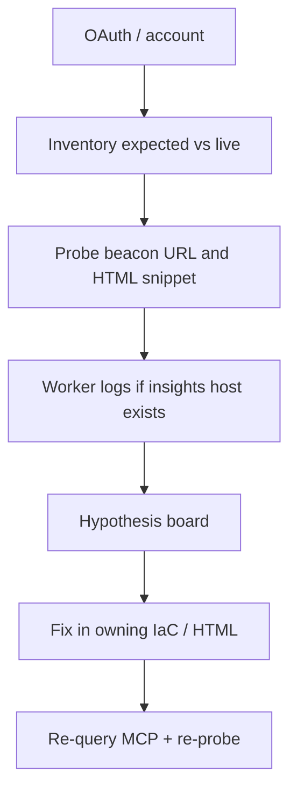

# Standard Operating Procedure: Cloudflare analytics ops

Use with [agent-cloudflare-ops](../skills/agent-cloudflare-ops/SKILL.md) and the `cloudflare-ops` MCP profile. Do **not** guess live account state.

Install once per session: `wk mcp cloudflare-ops --install` (OAuth on first Cloudflare tool use). One profile only - do not stack `cloud` + `ops`.

## Architecture (two modes)

| Mode | Where | Beacon | Ingest |
|------|--------|--------|--------|
| **Cloudflare Pages** (proxied) | Product `infra/cloudflare` `WebAnalyticsSite` | `autoInstall: true` - Cloudflare injects the snippet | `cloudflareinsights.com` |
| **GitHub Pages** (grey-cloud DNS) | `edge-dns` when `githubPages` is set | First-party Worker on `insights.<zone>` serving `beacon.min.js`; product HTML embeds `webAnalyticsSnippet` | **Must stay** on `cloudflareinsights.com` - Worker-proxied `send.to` 404s |

Discover expected sites from `edge-dns` `zones.yaml` plus each product’s `infra/cloudflare` stack. Do not hard-code a fleet list in this kit.

## MCP tools

| Server | Tools | Use for |
|--------|-------|---------|
| `cloudflare` (Code Mode) | `search`, `execute`, `docs` | List RUM sites (`GET /accounts/{id}/rum/site_info/list`), Workers, DNS, GraphQL analytics. **Never** `?codemode=false`. |
| `cloudflare-observability` | `observability_keys`, `observability_values`, `query_worker_observability` | Beacon Worker logs and errors |

`search` before `execute` unless the path is already known. Confirm keys/values before filtered observability queries.

## Loop

1. **Inventory** - `execute` RUM site list. Diff against Pulumi `WebAnalyticsSite` / `githubPages` origins. Flag duplicates (dashboard site vs stack site).
2. **Probe** - `GET https://insights.<zone>/beacon.min.js` (GitHub Pages mode) must be 200. Product HTML must contain the snippet **before** `</body>`. Pages auto-install sites should not also embed a stale first-party snippet.
3. **Logs** - For `insights.*` Workers, query observability (errors, 404s on `/beacon.min.js`).
4. **Hypotheses** - Keep ≤5. Cheap probes first (HTTP status, snippet present, `autoInstall` vs grey-cloud).
5. **Fix in the owning repo** - Pulumi for sites/Workers/DNS; product HTML for snippets. See ownership below.
6. **Prove** - Re-list RUM sites, re-probe URLs, re-query logs. Unit tests alone are not proof for a live beacon.

## Common failures

| Symptom | Likely cause | Fix where |
|---------|--------------|-----------|
| No RUM data, Pages site | `autoInstall` false or site not on the proxied zone | Product `infra/cloudflare` |
| No RUM data, GitHub Pages | Missing snippet, wrong `siteToken`, or ingest pointed at the Worker | Product HTML + `edge-dns` snippet output |
| `insights.<zone>/beacon.min.js` 404 | Worker or custom domain missing | `edge-dns` GitHub Pages origin |
| Duplicate RUM sites | Created in dashboard **and** Pulumi | Import the existing site; do not create a second |
| Beacon 200 but no events | Ingest URL rewritten to the Worker (`send.to` 404) | Restore ingest to `cloudflareinsights.com` |
| OAuth / 403 on MCP | Profile not installed or scopes too narrow | Re-auth; Account Settings Read + Workers observability |

## Ownership (do not mutate IaC via MCP writes)

| Resource | Owner |
|----------|--------|
| Zone, GitHub Pages origin DNS, `insights.<zone>` Worker, GH-Pages `WebAnalyticsSite` | `edge-dns` |
| Pages `WebAnalyticsSite` `autoInstall: true`, Observatory tests | Product `infra/cloudflare` |
| Grey-cloud snippet in HTML | Product repo (`index.html` / layout) |
| Shared `mzworthington.co.uk` beacon reused by gpio-build-monitor | `mzworthington` stack + consumer HTML |

`execute` **write** calls against those resources need explicit user approval. Default path is a Pulumi/HTML patch in the owner repo, then `pulumi preview`.

## Secrets

Never put `siteToken`, API tokens, or OAuth codes in handovers, memory MCP, or chat summaries. Refer to Pulumi outputs by name.
