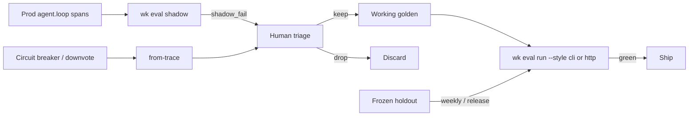

# Standard Operating Procedure: EDD Production Telemetry

Local and CI evals protect predefined intents. Production is unpredictable. Close the EDD loop by using the **same attribute schema** for agent spans and eval datasets - so yesterday's incident becomes tomorrow's passing case.

## Mechanisms

1. **Standardized span emitting** - `emitAgentSpan` records prompt, routing confidence, JSON tool payload, latency, and tokens (`wk .*` attributes). Sample span: [evals/edd/examples/otel-agent-loop.json](../evals/edd/examples/otel-agent-loop.json). Export to an OTLP collector with `wk SpanToOtlpJson` when you already run one.
2. **Asynchronous shadow evals** - Do not judge every live prompt inline. Sample with `shouldShadowEval(0.05)` / `wk eval shadow --infile … --sample 0.05`. Example corpus: [evals/edd/examples/prod-turns.jsonl](../evals/edd/examples/prod-turns.jsonl).
3. **Prod → JSONL (triage, then promote)** - On unhandled tool exceptions, circuit-breaker trips, user downvotes, or `shadow_fail`, run `productionTraceToJsonl` / `wk eval dataset from-trace`. **Do not append `--out` JSONL onto CI seeds or holdout.** Open each candidate:

   | Decision | When | Where it goes |
   |----------|------|----------------|
   | Keep | New matrix cell or a real miss with a human `expect` | Working golden (`evals/edd/goldens/write-cases.mjs` → regenerate). Tag `prod-derived`. |
   | Drop | Duplicate prompt+expect, junk prompt, unlabeled tool | Discard |
   | Holdout | Only when freezing a scored slice | `architecture_routing.holdout.jsonl` — never while tuning a prompt |

   Catalog example of a promoted miss: `prod-cb-01` in `architecture_terminal.jsonl`. Live architecture ranking: [evals/edd/goldens/README.md](../evals/edd/goldens/README.md).
4. **Trajectory parity** - Multi-step failures should preserve ordered tool calls in history so `plan_adherence` / trajectory reports can name the failing step after promotion.
5. **Routing drift detection** - Compare tool-share distributions with `detectRoutingDrift`. Alert when e.g. `read_architecture_yaml` drops from ~30% to ~2% traffic.

## Try the closed loop locally

```bash
wk eval shadow --infile evals/edd/examples/prod-turns.jsonl --sample 1 --seed 1 --out out/shadow-fails.jsonl
wk eval dataset from-trace --trace evals/edd/examples/prod-trace.json --out out/prod.jsonl
```

Fixtures: [examples/otel-agent-loop.json](../evals/edd/examples/otel-agent-loop.json), [examples/prod-turns.jsonl](../evals/edd/examples/prod-turns.jsonl), [examples/prod-trace.json](../evals/edd/examples/prod-trace.json).

## Dashboard signals

| Signal | Alert when | Where |
|--------|------------|--------|
| Routing accuracy (shadow) | Below CI threshold (default 95%) | Shadow job / `wk .passed` on sampled spans |
| Hallucination rate (judge) | Sustained rise vs baseline week | Shadow fails tagged `shadow_fail` |
| Circuit-breaker trips | Spike vs 7-day baseline | Spans / cases with `circuit_breaker` |
| Tool share drift | Absolute drop ≥ 20 pp | Aggregate `wk .tool_name` → `detectRoutingDrift` |
| Safety suite | Scripted gate or nightly live fails | CI |

Filter production spans / turns by attributes `wk .case_id`, `wk .tool_name`, `wk .passed` (and `service.name=kit-edd` when using OTLP).

## Closed loop



Yesterday's incident → triage → working golden (`prod-derived`) → live `wk eval run` → green before release. Do not auto-append onto CI seeds or holdout. Redact secrets from uploaded eval reports (harness redacts API-key-like strings in Markdown artifacts).
