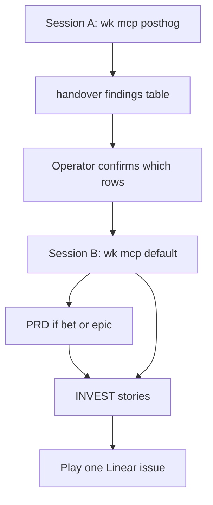

# Standard Operating Procedure: Product signal intake

Two sessions. One MCP profile each. A human gate before any Linear create.

This is the contract text for `product-signal-intake`. Skills that should load it later (pointer story, not this file): [agent-posthog](../skills/agent-posthog/SKILL.md) (Session A), [agent-user-stories](../skills/agent-user-stories/SKILL.md) and [agent-prd](../skills/agent-prd/SKILL.md) (Session B), [agent-orchestrator](../skills/agent-orchestrator/SKILL.md) (route, do not invent a product-insights skill), [agent-debug](../skills/agent-debug/SKILL.md) when the row is a bug.

SDK wiring and empty-events proof stay on [posthog-product-analytics](./posthog-product-analytics.md). Filing tickets stays on [linear-ticket-workflow](./linear-ticket-workflow.md) in Session B only.



## Session A — `wk mcp posthog`

1. Install one profile: `wk mcp posthog --install` (or `--project`). Do not stack PostHog onto `default`.
2. **List tools.** If official PostHog tools are still missing (Cloud Agent catalog, unfinished OAuth, headless host without a Bearer personal API key), do not invent project IDs or dashboard counts. `wk mcp --install` writes Cursor/Claude user files; it does not add tools to a hosted Cloud Agent session. Classify **empty-events** only from the live bundle (token present or absent; ingest host **name** only). Mark every other query blocked. Write the findings table. Stop. No Linear.
3. If tools exist, query the set below. Write a findings table into `~/.agents/handover/<project>/` using [templates/posthog-findings.md](../templates/posthog-findings.md). If `handover_posthog.md` already records SDK wiring, add a **PostHog findings** heading rather than wiping that handover.
4. Do **not** create Linear issues in this session. Do not call Linear MCP. Stop at the handover.
5. Restore `wk mcp default --install` (or `--project`) when Session A ends, even if filing happens later. `--install` replaces the default profile (Linear is gone until restore). The same chat can continue Session A after OAuth; do not stack PostHog onto `default`.
6. If the nominated consumer has no dedicated PostHog project, query the org project that actually ingested events. Name **hosts** from web stats, not tokens. Classify mixed-host ingest as its own row when traffic is not one site.
7. `projects-get` and the MCP active-environment blurb may include a project API key. Never copy it into the handover, memory, or chat tables.

## Human gate

The operator marks which rows to file. Unconfirmed rows stay skip. No agent creates Linear work from usage, a timer, or an unconfirmed table. If the operator asks to wrap up or finish intake without filling the Operator column, treat the Session notes recommended file/skip as confirmed. Blank rows that were not recommended stay skip.

## Session B — `wk mcp default`

1. Confirm the profile is `default` (`wk mcp default --install` / `--project`) so Linear is available.
2. If Linear tools are still missing, stop. Do not invent issue URLs. Leave INVEST / PRD drafts in the handover. File from a host that already has Linear.
3. File only confirmed rows:
   - **bug** → [agent-debug](../skills/agent-debug/SKILL.md) (or the empty-events checklist on the PostHog SOP if events never arrived).
   - **contract** and size **sitting** → [agent-user-stories](../skills/agent-user-stories/SKILL.md).
   - **bet** or size **epic** → [agent-prd](../skills/agent-prd/SKILL.md), then INVEST children.
   - **skip** → leave the row, no ticket.
4. Play one Linear issue after it exists. Do not invent a product-insights specialist.

## Query set (Session A)

| Look for | Treat as until classified |
|----------|---------------------------|
| Errors / error clusters | bug |
| Empty or dropping events | empty-events checklist, then bug or skip |
| Funnel drop-offs | contract or bet |
| Flag exposure vs leading indicator | bet if the flag is still a timeboxed experiment |
| Timeboxed bets due | confirm or kill via stories + prune, not a new skill |

Evidence window: date range and event *names*. Never paste `phc_` keys, project API secrets, or person identifiers into the handover.

Live-bundle empty-events (token present/absent in production JS) is allowed when MCP queries cannot run. That is the empty-events checklist, not a guessed funnel or error rate.

## Findings columns

Every row: **signal**, **evidence window** (no project keys), **kind** (`bug` / `contract` / `bet` / `skip`), **size** (`sitting` / `epic`), **proposed next agent**.

## Saved prompts

Paste in order. They match the diagram: Intake → File → Play.

### Intake (Session A)

```text
Session A: wk mcp posthog --install. Run product-signal-intake. Query errors, empty or dropping events, funnel drop-offs, flag exposure vs leading indicator, and timeboxed bets due. Fill templates/posthog-findings.md in the project handover. Do not create Linear issues. Restore wk mcp default when done.
```

### File (Session B, after the human gate)

```text
Session B: wk mcp default --install. File only operator-confirmed rows from the PostHog findings handover. Bug → agent-debug. Sitting contract → agent-user-stories. Bet or epic → agent-prd then stories. Skip the rest. Do not invent a product-insights skill.
```

### Play

```text
Play one confirmed Linear issue from the filed rows. Claim it In Progress, stay on main, leave the tree uncommitted.
```

### Missing PostHog tools (Session A stop)

```text
Session A: wk mcp posthog --install. Official PostHog tools are still missing. Write product-signal-intake findings with live-bundle empty-events only. Mark other queries blocked. Do not invent dashboard counts or Linear URLs. Restore wk mcp default when done.
```
