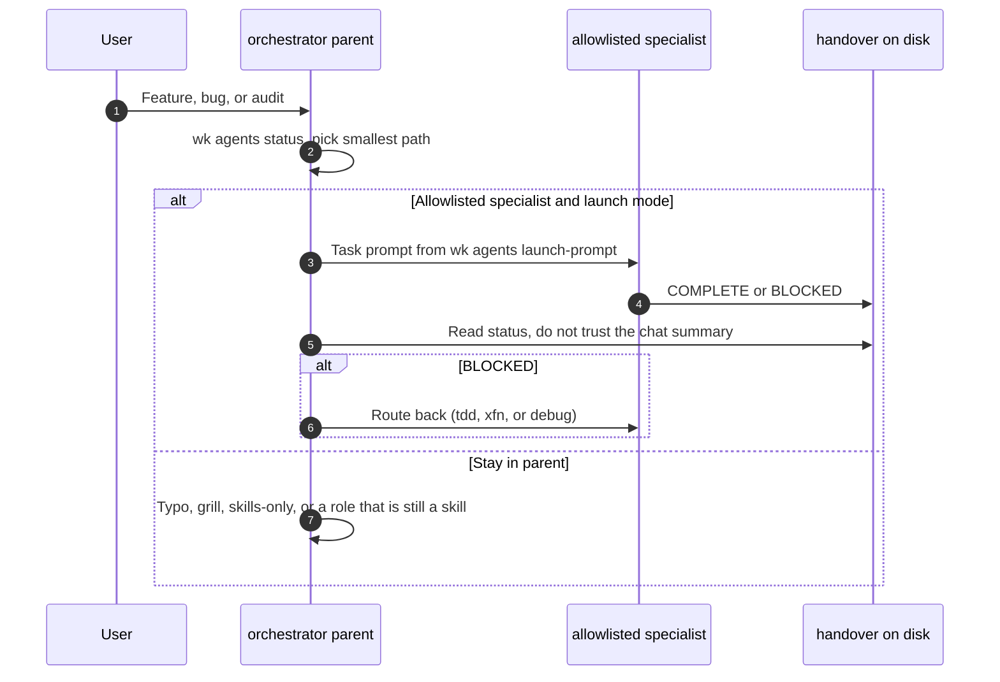
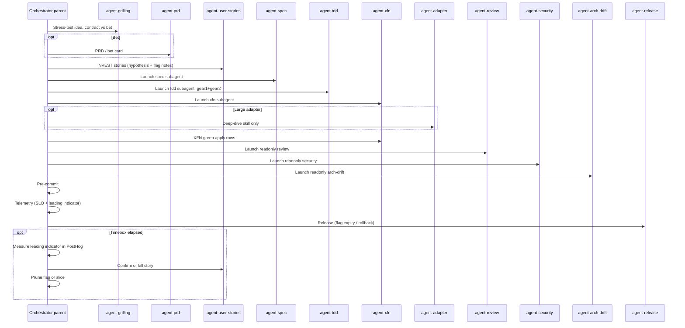

# Launch host subagents

Skills stay the playbook (`SKILL.md`). Host **subagents** are a process boundary: a fresh Cursor Task or Claude subagent, optional `readonly`, optional model class at launch. The parent is `agent-orchestrator`. The contract between windows is the handover file, not the chat summary.

Allowlist and install: [docs/subagents.md](../docs/subagents.md). Model class: [model-routing.md](./model-routing.md) (`wk model resolve --skill <id>`). Do not hardcode vendor slugs.



## Parent must pass

1. Linear id when playing a ticket.
2. Relevant handover paths under `~/.agents/handover/<project>/`.
3. Definition of Done for this phase.
4. Next agent (role skill name).

The child writes `COMPLETE` or `BLOCKED` to the handover and returns a short summary only.

Print the Task body (do not invent it):

```bash
wk agents launch-prompt --skill agent-tdd --project my-app \
  --linear MZW-59 \
  --handover ~/.agents/handover/my-app/handover_spec.md \
  --next agent-xfn
```

## Cursor Task invocation

After `wk agents install`, launch `~/.cursor/agents/<name>.md` as a Cursor **Task** (host subagent). The child does not inherit parent chat. Paste the `launch-prompt` output. Resolve the slug with `wk model resolve --skill <id>`. Do not paste `SKILL.md` into the prompt. When the Task returns, read `COMPLETE` or `BLOCKED` from `~/.agents/handover/<project>/`.

Claude Code: same contract with `~/.claude/agents/<name>.md`.

EDD’s `launch_specialist` tool is an **eval adapter** for this host Task. Live Cursor/Claude sessions do not call it.

Keep **one** MCP profile. If the specialist needs Cloudflare or PostHog, `wk mcp <profile> --project`, then restore `wk mcp default --project`. Do not stack vendor MCP onto the default profile.

## Routing rules

| Situation | Launch |
|-----------|--------|
| Spec after grilling/stories | `agent-spec` |
| Spec handover `COMPLETE`, implement the slice | `agent-tdd` (gear 1 **and** gear 2 in **one** child) |
| XFN apply rows / browser noise | `agent-xfn` (own window) |
| Failed CI, live symptom, RCA | `agent-debug` (own window). Do not open the full lifecycle. |
| Independent PR / OWASP / hex drift check | `agent-review`, `agent-security`, or `agent-arch-drift` with `readonly: true`. Handover and diff only. `BLOCKED` goes back to tdd or xfn. |
| Tiny typo / one-liner | Stay in the parent. |

Do not generate or launch `lang-*` / `framework-*` / `profile-*` as agents. Load those skills inside the specialist.

Do not split TDD across two agents. `agent-adapter` stays a skill when gear 2 is too large.

## Full lifecycle (when the scope gate says so)

Applies when [agent-orchestrator](../skills/agent-orchestrator/SKILL.md) selects **new feature / new bounded context**. Adapt with the light XFN floor on smaller routes ([behavior-catalog-and-xfn.md](./behavior-catalog-and-xfn.md)).



1. **Intake** - Claim a Linear id before routing. Grill if unsettled. Route **bets** to `agent-prd`, then `agent-user-stories`, then `agent-spec`. Tiny contracts may skip PRD.
2. **Design (functional)** - Launch `agent-tdd`: inventory functional catalog, align impact, first failing unit/slice tests. Next agent is `agent-xfn` (plan).
3. **Design (XFN plan)** - Launch `agent-xfn`: complete apply/skip matrix. All-skip only with reasons.
4. **Short loop** - Launch **`agent-tdd` again in one child**: gear 1 and gear 2 in the same session when ports are new/changed. Only if gear 2 is too large, load **`agent-adapter`** as a skill, then return.
5. **XFN green** - Launch `agent-xfn` (own window, not TDD) to green every **apply** row.
6. **Audit** - Launch readonly `agent-review` / `agent-security` / `agent-arch-drift`. Catalog or XFN honesty failures are `BLOCKED`. Hard-to-reverse choice without a record: load `agent-adr`.
7. **Pre-commit** - [agent-pre-commit](../skills/agent-pre-commit/SKILL.md) until green.
8. **Telemetry** - `agent-telemetry` for load SLOs from `handover_xfn.md`. Bet leading indicator: `agent-posthog`. Do not invent extra dashboards.
9. **Docs / Release** - `agent-docs` when public surfaces changed; load `agent-copy` for narrative. Then `agent-release`.
10. **Close the bet** - After the timebox: measure in PostHog, confirm or kill via `agent-user-stories`, then `agent-prune` for the flag or slice. Agent/tool/prompt misses need an EDD case ([hypothesis-driven-debug.md](./hypothesis-driven-debug.md) §11).

## Skills-only mode

Default is **launch**. Set `WK_SUBAGENTS=0` for this session (also `off` / `false` / `skills`) in the shell that starts the host, then run `wk agents status`. Stay in the parent and load the matching `SKILL.md`. Set `WK_SUBAGENTS=1` (also `on` / `launch`) to force launch even if `skills/subagents.yaml` has `skillsOnly: true`. Unset follows that YAML flag (`false` in the kit). Handovers still go to disk. Do not uninstall `~/.cursor/agents` for this mode.

When skills-only is on, do not call a host Task for spec, tdd, debug, xfn, or audit.

## Kill

Freeze the generate list if auto-delegation picks the wrong specialist more often than today’s skill picker. Run `wk eval miss-rate` after promoting misses with `wk eval dataset from-trace` into `evals/edd/subagent_routing.jsonl` and comparing to skill-picker misses in `evals/suites/routing-matrix.json`. No traces prints `not-enough`. A freeze verdict shows on `wk agents status` and `wk verify` fails if the generate list grows. Fix thin handovers before adding roles.
