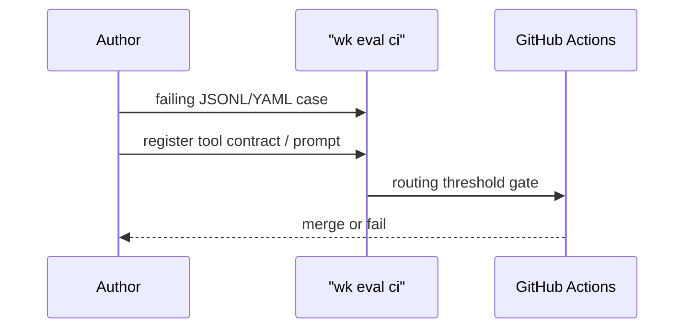

# 0003. EDD as the default for prompts, MCP tools, and routing

## Context and Problem Statement

LLM tool calling fails probabilistically (wrong tool, hallucinated args, retry loops). Markdown-only standards drift. We needed a red/green/refactor loop for agent contracts with CI-gated thresholds.

## Decision Drivers

* Treat prompts and tool schemas as versioned contracts
* Gate merges on measurable routing accuracy
* Keep always-on context thin (`wk measure-context`) so evals stay meaningful

## Considered Options

* **Option A:** Prompt review via human PR comments only
* **Option B:** Eval-Driven Development (EDD) as the default for agentic contract changes
* **Option C:** Optional evals, never blocking CI

## Decision Outcome

Chosen option: "**Option B**", because kit CI already gates EDD routing (≥95%) and the product pitch is testing rigor for agents. Guide: [docs/edd.md](../edd.md). SOP: [SOPs/eval-driven-development.md](../../SOPs/eval-driven-development.md).

### Consequences

* Good, because prompt/schema/routing regressions fail loudly
* Bad, because authors must write eval cases before changing agent contracts
* Follow-up: the `wk eval` harness is **alpha** (scripted merge gate, OpenAI-compatible live path). It is the default *method* for contract changes, not a complete EDD product. See [docs/edd.md](../edd.md).

## Architecture sketch

## Links

* Related ADRs: [0001](./0001-hexagonal-ddd-vertical-slices-default.md), [0004](./0004-thin-bootstrap-kit-knowledge-one-mcp-profile.md)
* Docs: [docs/edd.md](../edd.md)
