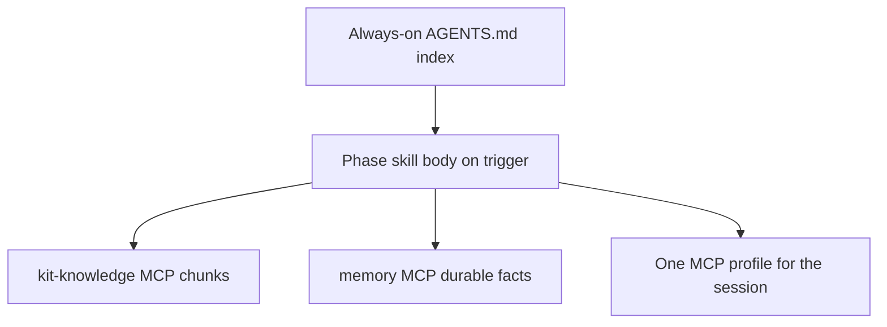

# 0004. Thin bootstrap, kit-knowledge chunks, and one MCP profile per session

## Context and Problem Statement

Dumping philosophy, SOPs, skill bodies, and a stacked MCP catalog into every turn burns the context budget and makes EDD routing evals meaningless. Agents still need kit procedures and live tools. We needed a lasting split: what is always-on versus retrieved, and how many MCP servers compete for tool-schema tokens.

## Decision Drivers

* Keep always-on bootstrap under ~2k tokens (`wk measure-context`)
* Retrieve SOP / philosophy / handover slices instead of bulk file reads
* Extra MCP tools compete for attention and inflate schemas
* EDD (ADR 0003) only stays honest if always-on context stays thin

## Considered Options

* **Option A:** Eager-load `CODING_PHILOSOPHY.md`, SOPs, and stacked MCP profiles in every session
* **Option B:** Thin `AGENTS.md` index; on-demand file read / **kit-knowledge** chunks; **one MCP profile** per session
* **Option C:** No MCP; agents always `Read` whole kit files

## Decision Outcome

Chosen option: "**Option B**", because invariants live in the thin handshake, procedure text is a retrieval problem, and profile composition is a session-scoped adapter choice. SOP: [SOPs/context-budget.md](../../SOPs/context-budget.md). Catalog: [mcps/README.md](../../mcps/README.md).

### Consequences

* Good, because default sessions stay lean (`wk -knowledge`, context7, github, memory, linear) and skills declare `mcp:` ids
* Bad, because agents must look up procedures instead of having full SOP text in every prompt
* Follow-up: do not stack `collab` + `devtools` + `ops` into one global `mcp.json`

## Architecture sketch

## Links

* Related ADRs: [0003](./0003-edd-default-for-agent-contracts.md)
* SOP: [SOPs/context-budget.md](../../SOPs/context-budget.md)
* MCP: [mcps/servers/kit-knowledge/README.md](../../mcps/servers/kit-knowledge/README.md)
