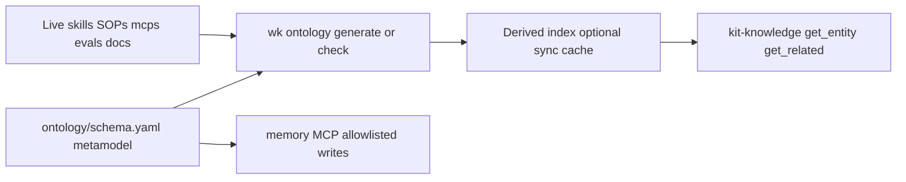

# 0005. Live-derived ontology index and typed memory allowlist

## Context and Problem Statement

Agents need a graph of skills, SOPs, MCPs, evals, and philosophy sections, plus a place for durable project facts. A committed hand-maintained index would drift from the kit tree. An unbounded memory graph would store secrets, kit-static duplicates, and invented entity types. We needed a persistence and retrieval contract that stays regenerable and typed.

## Decision Drivers

* Referential integrity against the live kit tree (`wk ontology check`)
* Kit-static facts vs cross-session facts must not share one store
* Write surface for memory must be an explicit allowlist, not free-form types
* Optional local cache must not become source of truth in git

## Considered Options

* **Option A:** Commit a generated `ontology-index.json` and treat it as canonical
* **Option B:** Hand-edit a full entity catalog in markdown beside `schema.yaml`
* **Option C:** Derive the index at use time from `ontology/schema.yaml` plus the live tree; gate **memory** `create_entities` on `memoryEntityTypes`; cache under gitignored `sync/`

## Decision Outcome

Chosen option: "**Option C**", because the metamodel is small and owned (`schema.yaml`), instances are the files agents already edit, and memory writes are limited to `GlossaryTerm`, `Slo`, `Preference`, and `ProjectFact`. Reads of legacy unknown types still succeed. Docs: [ontology/README.md](../../ontology/README.md).

### Consequences

* Good, because adding a skill or SOP updates the graph without a second catalog commit
* Bad, because consumers must not persist against a committed index shape; `sync/ontology-index.json` is a cache
* Follow-up: extend `memoryEntityTypes` only when teaching both the schema and the memory server; never store secrets in memory MCP

## Architecture sketch

## Links

* Related ADRs: [0004](./0004-thin-bootstrap-kit-knowledge-one-mcp-profile.md)
* Ontology: [ontology/README.md](../../ontology/README.md)
* Memory: [mcps/servers/memory/README.md](../../mcps/servers/memory/README.md)
