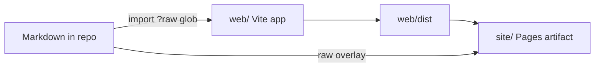

# 0006. Vite app renders public docs from Markdown

## Context and Problem Statement

The public site at eval-driven-development.dev was a hand-maintained `index.html` plus a copy of Markdown files for GitHub Pages. Landing copy drifted from `docs/`, the HTML was not reviewable as content, and adding a page meant editing chrome, sitemap, and assemble allowlists. We needed one authoring path: Markdown in the repo, HTML as a build.

## Decision Drivers

* Landing and guides should be editable as Markdown
* Stable `.md` URLs for agents (`llms.txt`, kit-knowledge) must stay
* GitHub Pages remains the origin (DNS in edge-dns)
* Match the ArchLens / product-template pattern: Vite imports `*.md?raw`, `react-markdown`, prerendered route shells for crawlers

## Considered Options

* **Option A:** Keep the static HTML landing and copy Markdown into `site/`
* **Option B:** VitePress / Docusaurus as a separate docs framework
* **Option C:** Vite + React docs app in `web/`, glob Markdown from `docs/`, `SOPs/`, and eval write-ups, prerender routes, overlay raw Markdown on the Pages artifact

## Decision Outcome

Chosen option: "**Option C**", because it reuses the same docs pipeline as ArchLens without a second product SPA, and authors still ship `.md` files next to the HTML app.

### Consequences

* Good, because a new SOP or ADR is a Markdown file; the sidebar is derived from the glob
* Good, because interactive landing widgets (today jobs, eval demo, ontology) are explicit `widget` fences in `docs/home.md`
* Bad, because `pnpm --dir web build` is required before `wk site assemble`
* Site chrome lives in `web/` (`site.css`, landing widgets, `web/public/assets/` logos). Ontology generate writes gitignored `web/public/assets/ontology-index.json`.

## Architecture sketch

## Links

* Related ADRs: [0004](./0004-thin-bootstrap-kit-knowledge-one-mcp-profile.md)
* Arch norms: hexagonal, DDD, vertical slices ([CODING_PHILOSOPHY](../../CODING_PHILOSOPHY.md) via kit)
