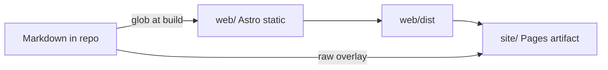

# 0007. Astro emits the public docs site as static HTML

## Context and Problem Statement

ADR 0006 made Markdown the authoring path and a Vite React SPA the HTML app, with a post-build prerender pass for crawlers. That still shipped a client router as the route of record, duplicated crawler HTML, and lagged Core Web Vitals / SEO compared with HTML-first pages. We needed the same operator UX (chrome, widgets, copy) on real static documents, TypeScript, and the existing GitHub Pages + edge-dns origin.

## Decision Drivers

* Crawlers and social previews must receive full HTML without executing a SPA
* Authors still edit Markdown in `docs/`, `SOPs/`, and eval write-ups
* GitHub Pages remains the origin (DNS in edge-dns)
* Visual design and interactive widgets stay the same
* Agents converting or extending the site should load a kit `framework-astro` profile plus Astro Docs MCP

## Considered Options

* **Option A:** Keep Vite SPA + prerender plugin (status quo, ADR 0006)
* **Option B:** VitePress / Starlight as a separate docs framework
* **Option C:** Astro static output in `web/`, React islands for widgets, GitHub Actions assemble unchanged

## Decision Outcome

Chosen option: "**Option C**", because Astro is the delivery adapter for content sites, TypeScript + static HTML match GitHub Pages, and React islands preserve the jobs / eval / ontology / mermaid widgets without a client-side router.

Supersedes [0006](./0006-vite-markdown-docs-site.md).

### Consequences

* Good, because each published path is a real HTML document with layout-owned SEO (canonical, JSON-LD, Open Graph)
* Good, because `wk site assemble` still overlays raw `.md` URLs for agents
* Bad, because in-app navigation is multi-page (view transitions optional) instead of SPA routing
* Good, because chrome is Astro HTML and only nav / widgets / mermaid hydrate as islands
* Follow-up: self-host IBM Plex if Google Fonts becomes a privacy or LCP issue

## Architecture sketch

## Links

* Related ADRs: [0006](./0006-vite-markdown-docs-site.md) (superseded)
* Skill: [framework-astro](../../skills/framework-astro/SKILL.md)
* Arch norms: hexagonal, DDD, vertical slices ([CODING_PHILOSOPHY](../../CODING_PHILOSOPHY.md) via kit)
