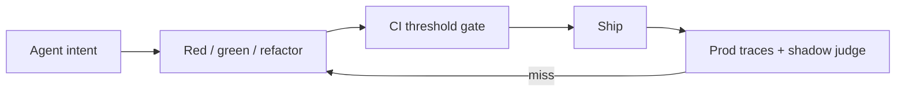
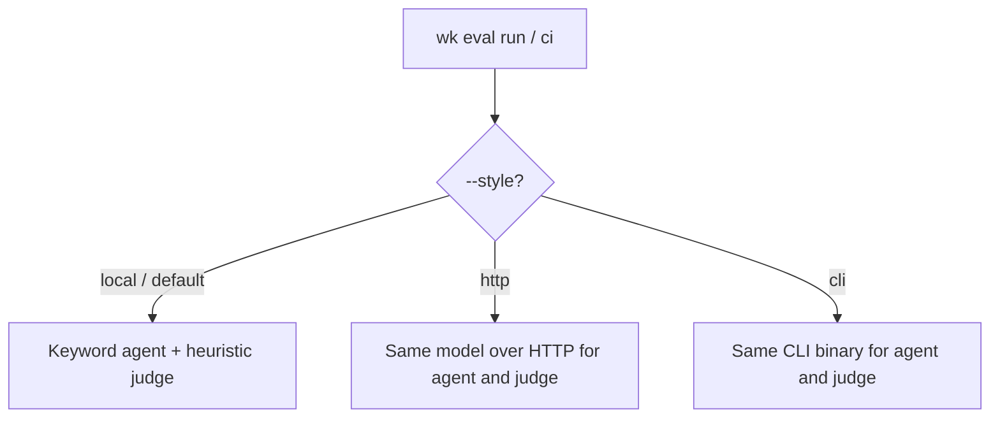

# Eval-Driven Development (EDD) — alpha

Connecting an LLM to MCP tools, APIs, or terminals turns a chatbot into a decision-maker. Failures rarely look like stack traces. They look like a wrong tool, a hallucinated parameter, or an infinite retry loop.

**Status: alpha.** Waykit ships a routing and schema harness you can run in CI. It is not a full EDD framework. There is no prompt registry, no hosted dataset product, no native Anthropic or Gemini judge, and the default merge gate does not call a product LLM. Skill-trigger `wk eval` (no subcommand) only checks which Kit skill should activate. Use this loop when you change prompts, tool schemas, or routing. Do not treat a green `wk eval ci` as proof that the live agent is correct.

What you do get today:

- YAML suites + JSONL cases, mocked tools, dual-layer asserts
- A **scripted** (`--style local`) merge gate so PRs fail on keyword routing drift
- Optional **http** (OpenAI-compatible `/chat/completions`) and **cli** (`cursor-agent`, `claude`, `agy`) runs
- Dataset helpers and a production → JSONL / shadow path (`wk eval dataset from-trace`, `wk eval shadow`, `wk eval miss-rate`)

Still to build before this is a framework: live judges per provider, skill-trigger evals that actually run a model, stronger structured output from CLI hosts, and a tighter closed loop from prod traces into suites.

EDD treats prompts and tool schemas as version-controlled, evaluated contracts. The harness is one learning loop inside the feature lifecycle, not the whole product.

## The loop (same shape as TDD)

1. **Red - Define intent.** JSONL cases and YAML metrics assert the tool (and arguments) you expect, and that chatty questions do not invent tool calls.
2. **Green - Implement the interface.** Register the MCP/tool contract and minimal system instructions. Run until asserts pass.
3. **Refactor - Refine context.** Iterate descriptions and constraints without breaking existing cases. Gate merges with `wk eval ci --threshold-routing 95`.



## Why run it this way

| Capability | Outcome |
|------------|---------|
| **Context isolation** | Fresh context per case. No cross-test contamination. |
| **Deterministic mocks** | Measure routing and extraction, not third-party latency. |
| **Dual-layer asserts** | Schema/shape plus argument meaning, task completion, criteria judge, optional LLM-as-a-judge. |
| **CI quality gates** | `wk eval ci --threshold-routing 95` blocks routing drift; safety suite runs in `wk check`. |
| **Closed-loop telemetry** | Production misses become `.jsonl` cases (`wk eval dataset from-trace`); `wk eval shadow` samples live turns into the suite; `wk eval miss-rate` compares specialist-launch vs skill-picker prod-derived rates. |
| **Dataset hygiene** | `wk eval dataset lint\|dedupe\|synthesize\|from-trace` keeps suites valid and scalable. |

Bare `wk eval` still validates which Kit skill activates. `wk eval run|watch|report|ci` validates how an agent calls tools. Use EDD whenever you change prompts, tool schemas, or routing.

## Quick start

```bash
curl -fsSL https://raw.githubusercontent.com/mzworthington/waykit/main/install.sh | sh
wk init . --mcp default --hook

wk eval run --suite evals/edd/architecture_routing.yaml --model scripted
wk eval ci --threshold-routing 95 --out out/reports
wk eval report --format md --out out/reports
wk eval watch --suite evals/edd/architecture_routing.yaml --target evals/edd
wk eval dataset lint --dataset evals/edd/architecture_routing.jsonl
wk eval miss-rate
```

## Cursor, Claude, Copilot, Antigravity, and API keys

Rules and MCP install across those hosts: [hosts](./hosts.md). Daily work and the merge gate use `--style local` (alias: `--model scripted`). You do **not** need a provider API key for that. The IDE chat is never the eval runner.

Each run has **one style** for both the agent under test and the judge:

| Style | Flag | Agent | Judge |
|-------|------|-------|--------|
| **local** | default, `--style local` | Keyword stub | Heuristic patterns |
| **http** | `--style http --model <id>` plus key or `--base-url` | OpenAI-compatible `/chat/completions` | Same HTTP model |
| **cli** | `--style cli --cli cursor-agent\|claude\|agy --model <id>` (`--cli` is required) | Headless CLI JSON | Same CLI and model |



`--style local` never spends, even if a key is in the environment. Cases tagged `requires-live` are skipped on local. `--style http` and `--style cli` run them.

### Cursor Agent CLI as the agent under test

`cursor-agent` is not OpenAI `/chat/completions`. Kit prompts it in `--mode=ask` and expects a JSON envelope `{ "content": "…", "tool_calls": [{ "name": "<eval tool>", "arguments": {} }] }` using only registered eval tools. After a tool call, the harness fills `content` from the mock JSON (quality metrics grade that grounded text). Token totals come from the CLI JSON `usage` object when present (`inputTokens` / `input_tokens` / `prompt_tokens`); otherwise Kit estimates ~4 characters per token. Suite summaries include a rough USD line using `$0.003` per 1k tokens (`DEFAULT_TOKEN_USD_PER_1K`). Override with `wk _EVAL_TOKEN_USD_PER_1K`, or set it to `0` to hide USD. Local/scripted models omit USD. Judge calls use the same `--cli` and `--model`.

```bash
noglob wk eval run --suite evals/edd/architecture_routing.yaml \
  --style cli --cli cursor-agent --model cursor-grok-4.6-medium
```

### When a key is used

The runner takes the first non-empty value:

1. `KIT_EVAL_API_KEY` (OpenAI-compatible HTTP style)
2. `OPENAI_API_KEY`
3. `ANTHROPIC_API_KEY`

Weekly live CI does not use that HTTP chain. It reads `CURSOR_API_KEY` and shells out to `cursor-agent`.

That value is sent as `Authorization: Bearer …` to an **OpenAI-compatible** `{baseUrl}/chat/completions`. Base URL resolution: `wk _EVAL_BASE_URL`, then `OPENAI_BASE_URL`, then `https://api.openai.com/v1`.

`ANTHROPIC_API_KEY` is only useful if `wk _EVAL_BASE_URL` points at a gateway that accepts Anthropic keys on the OpenAI request shape. Anthropic’s native Messages API is not this client.

The same key and model are reused for:

- **Agent:** given this prompt and these tools, which call do you make?
- **Judge:** second completion for `llm_as_judge` / `criteria_judge` / `task_completion`

```bash
# Local model server (no paid key)
wk eval run --suite evals/edd/architecture_routing.yaml \
  --style http --base-url http://localhost:11434/v1 --model llama3.1

# Cursor Agent CLI (agent and judge)
noglob wk eval run --suite evals/edd/architecture_routing.yaml \
  --style cli --cli cursor-agent --model cursor-grok-4.6-medium
```

PR Verify and `wk check` stay `--style local` (no key). Weekly live uses **cli** (`cursor-agent` + `CURSOR_API_KEY`). Use **http** for OpenAI-compatible providers. CLI runs hit subscription rate limits and have weaker structured-output guarantees.

Optional: `wk _EVAL_MODEL`. Rough USD uses `$0.003` per 1k tokens unless `wk _EVAL_TOKEN_USD_PER_1K` is set (`0` disables). Local OpenAI-compatible servers also work via `wk _EVAL_BASE_URL`.

## Metrics and suites

Beyond tool selection and schema shape, suites can assert:

| Area | Metrics / tooling |
|------|-------------------|
| Outcome quality | `argument_correctness`, `task_completion`, `criteria_judge` |
| MCP / multi-step | `mcp_use`, `plan_adherence`, `step_efficiency`, trajectory traces in reports |
| Safety | `evals/edd/safety.yaml` (injection + no-tool; in `wk check` and nightly live) |
| Extensibility | `type: plugin` modules; `wk eval dataset lint\|dedupe\|synthesize\|from-trace` |

Full metric table and harness layout: [evals/edd/README.md](../evals/edd/README.md).

### CI

| Job | Key | Model | Purpose |
|-----|-----|--------|---------|
| **Verify** in [`.github/workflows/ci.yml`](../.github/workflows/ci.yml) | unused | `--style local` via `wk check` | Merge gate: harness + keyword routing + safety + recovery |
| Weekly [`.github/workflows/edd-live.yml`](../.github/workflows/edd-live.yml) | **requires** `CURSOR_API_KEY` | repo variable `KIT_EVAL_MODEL` (default `cursor-grok-4.6-medium`) | `cursor-agent` paraphrases, prompt-injection, multi-tool, safety |
| `pnpm check` / `wk check` | unused | `--style local` | Same as Verify, locally |

Weekly **skips the whole job** if `CURSOR_API_KEY` is empty. Set it with `gh secret set CURSOR_API_KEY --body "$CURSOR_API_KEY"`. Optional `KIT_EVAL_MODEL` overrides the default Cursor model id.

Verify and the weekly live job (plus Pages deploy) publish a **job summary**: what the gate means, then an EDD overview table and collapsible full report via `wk eval report --github-summary`.

### Local live run

```bash
export CURSOR_API_KEY='…'
noglob wk eval run --suite evals/edd/architecture_routing.yaml \
  --style cli --cli cursor-agent --model cursor-grok-4.6-medium
```

You should then see `requires-live` cases execute instead of “Skipping N requires-live case(s)”.

## Next

| Resource | Purpose |
|----------|---------|
| [SOPs/eval-driven-development.md](../SOPs/eval-driven-development.md) | Day-to-day procedure |
| [evals/edd/README.md](../evals/edd/README.md) | Suites, metrics, layout |
| [evals/edd/goldens/README.md](../evals/edd/goldens/README.md) | Live golden + holdout (architecture routing) |
| [SOPs/edd-production-telemetry.md](../SOPs/edd-production-telemetry.md) | `wk .*` spans, `wk eval shadow`, from-trace, drift |
| [skills/agent-orchestrator/SKILL.md](../skills/agent-orchestrator/SKILL.md) | Feature lifecycle around EDD |
