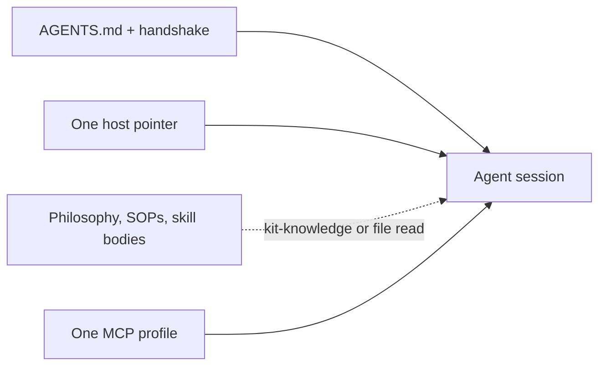

# What Waykit gives you

Waykit is the SDLC for coding agents. The rest of this page is what that install actually puts on disk: a thin handshake, on-demand skills, one MCP profile per host, a quality gate, and learning loops. Eval-driven development (**alpha**) is how you prove tool routing in CI; it is not the whole product and it is not a complete EDD framework.

Independent assessment (value + model-/host-agnosticism) and open follow-ups: [kit-value-and-model-agnostic-review.md](./kit-value-and-model-agnostic-review.md), [kit-review-backlog.md](./kit-review-backlog.md). Host adapters: [hosts.md](./hosts.md). Feature work: [Feature lifecycle](./lifecycle.md) (grill → stories → TDD → XFN → telemetry → confirm or kill). After a bet’s timebox, measure the leading indicator in PostHog, then stories or prune — not a separate insights role.

## Always-on context

Agents pay for every byte in the bootstrap. Waykit keeps **always-on** files small and loads philosophy, SOPs, and skill bodies **on demand**.

| Surface | In the always-on total? | Target |
|---------|-------------------------|--------|
| `AGENTS.md` + project handshake | Yes | **&lt; ~8KB** (~2k tokens) |
| Thin host pointers (`.cursorrules`, `CLAUDE.md`, Copilot, `GEMINI.md`) | Printed, not summed | One pointer per session |
| Skill descriptions (frontmatter only) | No (discovery) | Fine; do not pre-load skill bodies |
| `CODING_PHILOSOPHY.md` and SOP files | No | Zero on typo/debug routes unless that procedure is needed |

```bash
wk measure-context
```

Prints a character/token estimate per file and **FAIL** if always-on exceeds 8KB. Re-run after editing `AGENTS.md` or the handshake template. `wk check` runs this gate last.

Agent checklist: [SOPs/context-budget.md](../SOPs/context-budget.md).



## One MCP profile per session

Extra MCP tools compete for attention and inflate tool-schema tokens. Compose **one** named profile:

```bash
wk mcp default --install
wk mcp default --install --host claude
wk mcp default --project
wk mcp collab --install
wk mcp ops --install
wk mcp cloudflare-ops --install
wk mcp warp --install
wk mcp posthog --install
wk mcp sonar --install
```

Match the profile to the skill’s `mcp:` frontmatter. Do not merge collab + devtools + ops into one global `mcp.json`. Catalog: [mcps/README.md](../mcps/README.md). Procedure: [SOPs/mcp-library.md](../SOPs/mcp-library.md).

## Quality gate

`wk check` is the local merge bar:

1. `wk audit`: prompt injection, secrets, entropy, lockfile pins
2. `wk validate` / `wk verify`: eval schemas, skills layout, and role line budget
3. `wk ontology check`: live-derived graph refs (`depends-on`, `mcp`, subagent stubs)
4. IDE rules match `AGENTS.md`
5. Skill-trigger evals (registration / prompt hygiene; not a model run) and EDD `wk eval ci` (scripted, 95% routing)
6. Context budget

```bash
wk check
wk check --json
wk audit
wk sync --install
```

`wk sync` installs upstream skills (Cloudflare, Vercel) from [skills/external.lock.json](../skills/external.lock.json) by **version tag** or `latest`, not a guessed commit SHA. [SOPs/external-skills.md](../SOPs/external-skills.md).

## TDD Guard hooks

`wk tdd-guard install` writes Cursor `.cursor/hooks.json` and Claude Code `.claude/settings.json` so Write/Edit cannot skip red. The command reads hook JSON on stdin. Procedure: [TDD Guard hooks](../SOPs/tdd-guard.md). Inspired by [TDD Guard](https://github.com/nizos/tdd-guard).

## Repo doctor

`wk doctor` is the community-file check for **GitHub sources you admin**, not a glob over every clone. Report-only by default. `--write` fills missing README, license, contributing, security, and GitHub templates and never overwrites existing files. `--owned --scan <dir>` matches local worktrees to `gh repo list --source`. Forks are skipped. `wk init` still owns the handshake and hooks.

Guide: [Repo doctor](./doctor.md). Consumer handshake: [Consumer align](./align.md) (including the reusable PR workflow). First-party clones: [Used on our own product repos](./used-in.md).

```bash
wk doctor
wk doctor --owned --scan ~/Documents/dev
wk doctor . --write
wk doctor . --json
```

## Live kit graph

Skills, host subagent stubs, SOPs, MCP servers, evals, and docs are one graph derived from the files agents already edit. You do not maintain a second catalog. `wk ontology check` fails dangling `depends-on`, `mcp:`, and subagent→skill refs. `wk ontology generate` writes a gitignored index for kit-knowledge and the public map.

Browse: [Waykit map](./map.md). Authoring: [Author the Waykit map](/ontology). Decision: [ADR 0005](./ADRs/0005-live-derived-ontology-memory-allowlist.md).

## Commands

Day to day you operate the kit with `wk`. On a TTY, `wk` with no arguments opens a guided menu. Scripts keep the same verbs: align for handshake, doctor for community files, check for the merge bar. Skills and `AGENTS.md` tell the agent which path to load (debug vs feature). `wk help` lists the rest.

Every **report** command starts with `ok`, `warn`, or `fail` in a fixed column (`fail` is exit 1; `warn` stays exit 0). On a TTY those tokens are green / orange / red; `NO_COLOR` or a pipe stays plain. Details follow that line.

| Command | What it measures or installs |
|---------|------------------------------|
| `wk align` | Consumer handshake, host pointers, kit MCP, commit-msg (`--write` seeds missing AGENTS.md and pointers; `--owned --scan` for a worktree farm; `--json` for findings) |
| `wk doctor` | Community files on owned GitHub sources (`--owned`, `--write`; `--json` for findings) |
| `wk check` | Audit, ontology, evals, EDD CI, context budget (`--json` for findings) |
| `wk version` | Kit package/git describe and whether `~/.agents` is this clone (`--check` warns if origin is weeks ahead) |
| `wk measure-context` | Always-on bootstrap size vs 8KB |
| `wk completion zsh` | Print a live tab-completion stub (`wk completion install` writes it once) |
| `wk ontology check` | Live graph referential integrity |
| `wk agents generate` | Thin host stubs under `agents/` from the allowlist |
| `wk agents install` | Copy stubs into `~/.cursor/agents` and `~/.claude/agents` (user scope) |
| `wk agents status` | Launch vs skills-only (`WK_SUBAGENTS`) and the expand-kill indicator |
| `wk agents launch-prompt` | Parent Task prompt for one allowlisted specialist |
| `wk ontology generate` | Write gitignored index for kit-knowledge and the map |
| `wk mcp <profile>` | One MCP profile into Cursor, Claude, Copilot, and Antigravity |
| `wk audit` | Skills and scripts supply-chain scan |
| `wk eval ci` | Routing accuracy gate (EDD) |
| `wk sync` | Upstream skills from the lockfile, then refresh user kit subagent stubs |

EDD loop (alpha), keys, and CI: [edd.md](./edd.md). Host files: [hosts.md](./hosts.md).
