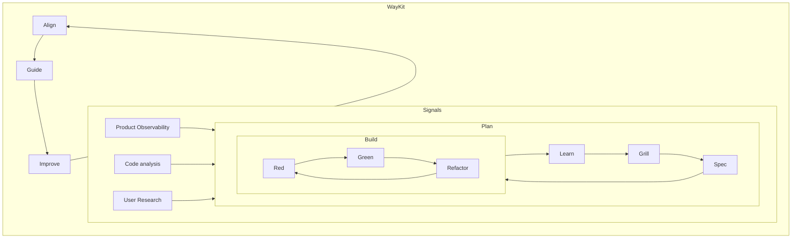

# Quality loops

EDD and `wk` wrap the work. Feature PDLC and Learn sit inside that loop. TDD is the inner bar of a planned change. After ship, Learn takes what the world found and feeds the next session:

- **Evals** prove tool routing in CI ([EDD guide](./edd.md), alpha).
- **Quality loops** turn CI, RUM, Lighthouse and Sonar into typed Linear tickets, then draft PRs. No extra specialist.

The playbook agents follow is [quality loops through Linear](/SOPs/quality-loops). This page is the map: the bar versus the loops, what counts as an outside source, and what does not.

## The bar versus the loops

| Layer | Inside a planned change | After ship, from outside |
|-------|-------------------------|---------------------------|
| Job | Keep the bar | Make the next session smarter |
| What you run | One failing test, then the smallest change. XFN on UI, auth and SLOs. Hexagonal boundaries. `wk check` before COMPLETE. | A miss becomes a failing eval. Red checks, RUM, Lighthouse and Sonar file Linear. The work picker plays allowlisted tickets as draft PRs. |
| Who owns it | [Feature lifecycle](./lifecycle.md) | This page, then the SOP |

EDD is alpha: routing contracts, not a full eval product. The suite and `wk` wrap the PDLC and Learn. When the change is a prompt or a tool schema, the inner bar is an eval case.

## Nested loops



Learn starts *outside* a planned feature: a red required check, a RUM break, a Lighthouse drop versus last main, a Sonar finding, or an eval miss. Those sessions still run inside the EDD / `wk` loop.

## Outside sources

These are inbound. They are not another phase chip on the PDLC.

| Source | Files as | What it is not |
|--------|----------|----------------|
| Failed required check | Bug | A PR in the filing session |
| Cloudflare RUM / beacon break | Bug on the owning repo | Site tokens. Hostnames only. |
| Lighthouse drop vs last main | Performance | A ticket to chase 100 |
| Sonar BUG / vuln / smell | Bug / Security / Improvement | NOSONAR to silence a kit skip |
| PostHog *error* | Bug after restore default | Funnel or bet rows. Those stay on [product signal intake](/SOPs/product-signal-intake). |
| Dependabot / CodeQL | Stay on the vendor PR | A lockfile rewrite "to be helpful" |
| Scheduled scout | One typed ticket, evidence, no PR | Every source collaged into one session |

gpio-build-monitor may ingest alerts. It does not write product code.

Fingerprint tickets (`source:repo:stable-id`; RUM `source:<owning-repo>:rum:<hostname>`). Comment on an open match. Do not clone.

## Three sessions, one loop

1. **File.** One Automation per source. Cloud sessions only see MCP servers on the Cursor dashboard; `wk mcp --install` rewrites local host files only. Missing dashboard tools → stop **BLOCKED**. Restore `wk mcp default` before Linear create. Do not invent site tags, tokens or Linear URLs. Operator CLI: `wk loops status` / `wk loops setup --write` (catalog in `lists/quality-loop-automations.yaml`; Cursor has no Automations create API).
2. **Hygiene.** Same fingerprint or near-duplicate title+body: one stays playable. Rewrite Backlog/Todo that is missing Story, Work type or an observable Then. Leave Done/Canceled. Skip gated PostHog bets. Unsure: comment and leave. No PRs in hygiene.
3. **Play.** The work picker reads the [allowlist](https://github.com/mzworthington/waykit/blob/main/lists/work-picker-allowlist.yaml). Claim one Backlog or Todo in `auto_play` (or with `auto-work`, without `hold`). Bug → `agent-debug`. Security → `agent-security`. Performance → `agent-perf-opt`. Improvement → a write role. Draft PR only. Never merge, force-push, skip hooks or hide a CI failure. Before COMPLETE run the repo pre-commit hook, not a path-filtered test.

## Evals versus quality loops

| Loop | Job | Gate |
|------|-----|------|
| EDD (alpha) | Prompt, tool schema or routing change | `wk eval ci --threshold-routing 95`. A miss becomes a failing case. |
| Quality loops | CI, RUM, Lighthouse, Sonar and scout | Typed Linear ticket, then an allowlisted draft PR |

A green eval CI run is routing, not proof that the live agent is correct. Details: [EDD guide](./edd.md).

## What this is not

- A new `agent-quality-loops` skill. Orchestrator routes to the SOP.
- Auto-merge, or one Automation that watches every source.
- Auto-filing PostHog funnel or bet rows.
- Hiding a red required check behind a ticket.

Kill the loop if it hides a CI failure or duplicates outpace hygiene.

## Operator CLI

```bash
wk loops status .
wk loops setup --write
wk help loops
```

`status` prints the catalog (one Automation per source), the dashboard MCP checklist, and recorded UUIDs from `.cursor/waykit-loops/overlay.yaml`. `setup --write` fills `.cursor/waykit-loops/` (never overwrites): per-loop prompts, `AUTOMATE.md` for Cursor `/automate`, and the overlay. Cursor has no Automations create or list API; the pack is the kit on disk. Connect GitHub, Linear, PostHog, Cloudflare Observability, and SonarQube on [cursor.com/agents](https://cursor.com/agents).

## Related

- Procedure: [Quality loops through Linear](/SOPs/quality-loops)
- Prompts: [quality-loops templates](https://github.com/mzworthington/waykit/blob/main/templates/quality-loops.md)
- Feature path: [Feature lifecycle](./lifecycle.md)
- Evals: [EDD guide (alpha)](./edd.md)
- Sonar triage: [SonarQube findings](/SOPs/sonarqube-findings)
- RUM / beacon diagnosis: [Cloudflare analytics ops](/SOPs/cloudflare-analytics-ops)
- PostHog bets: [Product signal intake](/SOPs/product-signal-intake)
