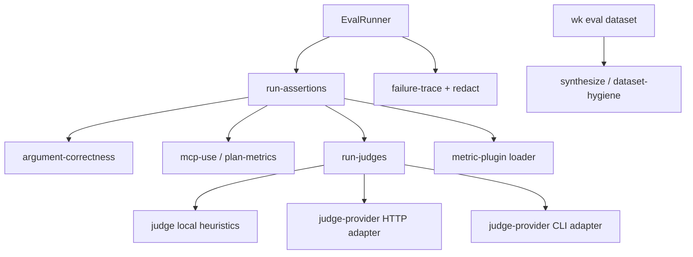

# Eval-Driven Development (EDD) suites (alpha)

Suite reference for Kit’s agent eval harness. Day-to-day steps in [SOPs/eval-driven-development.md](../../SOPs/eval-driven-development.md). Companion: [SOPs/edd-production-telemetry.md](../../SOPs/edd-production-telemetry.md).

## Layout

```text
evals/edd/
├── README.md
├── system_prompt.md
├── kit_knowledge_prompt.md
├── demo.yaml|.jsonl          ← first-hour teaching suite
├── examples/before-after.md
├── examples/eval-report.md
├── examples/prod-trace.json
├── examples/otel-agent-loop.json   ← kit.* OTel span fixture
├── examples/prod-turns.jsonl      ← shadow-eval NDJSON corpus
├── architecture_routing.yaml|.jsonl   ← CI seed (frozen unique intents)
├── goldens/                           ← live golden + holdout (not kit check)
├── architecture_self_correction.yaml|.jsonl
├── architecture_terminal.yaml|.jsonl
├── kit_knowledge.yaml|.jsonl
├── model_routing.yaml|.jsonl
├── subagent_routing.yaml|.jsonl
├── subagent_routing_skills_only.yaml|.jsonl
├── cloudflare_ops.yaml|.jsonl
├── safety.yaml|.jsonl
└── tools/*.json
```

## Styles

One style per run for **both** agent and judge.

| Style | When | What it proves |
|--------|------|----------------|
| `local` (CI default) | `wk eval ci`, PR CI (`wk check`), `--model scripted` | Harness, schema, keyword routing. **Not** a product LLM test. No API key. |
| `http` | `--style http --model <id>` with key or `--base-url`; weekly [`.github/workflows/edd-live.yml`](../../.github/workflows/edd-live.yml) | Same model for routing and quality metrics. Includes `requires-live` cases. |
| `cli` | `--style cli --cli cursor-agent\|claude\|agy --model <id>` (`--cli` is required) | Same CLI binary for agent and judge. |

Cursor is not the only host. MCP and model overlays are written for Cursor, Claude Code, Copilot, and Antigravity ([docs/hosts.md](../../docs/hosts.md)). None of them is the eval driver: `wk eval` never calls Cursor Chat or Copilot Chat. Env resolution, CI jobs, and examples: [docs/edd.md](../../docs/edd.md). **EDD is alpha.**

Do not extend the local keyword driver to pass `requires-live` cases. Add JSONL rows instead. Volume for live ranking lives in [goldens/](./goldens/README.md) — not in CI seeds.

## Live goldens

Architecture routing has a **CI seed** (`architecture_routing.jsonl`, unique intents, `wk check`) and a **live golden** (`goldens/`, 80 working + 20 holdout). Run goldens with `--style cli` or `--style http`. Do not add them to `EDD_CI_SUITES`. Do not grow them with `dataset synthesize`. Procedure: [goldens/README.md](./goldens/README.md).

## Quick start

First-hour teaching suite (six cases, before/after story in [examples/before-after.md](./examples/before-after.md)):

```bash
wk eval run --suite evals/edd/demo.yaml --model scripted
wk eval ci --suite evals/edd/demo.yaml --threshold-routing 95 --model scripted --out out/reports
wk eval report --format md --out out/reports
```

Full regression / CI suites:

```bash
wk eval run --suite evals/edd/architecture_routing.yaml --model scripted
wk eval ci --suite evals/edd/kit_knowledge.yaml --threshold-routing 95 --model scripted --out out/reports
wk eval ci --suite evals/edd/model_routing.yaml --threshold-routing 95 --model scripted --out out/reports
wk eval ci --suite evals/edd/subagent_routing.yaml --threshold-routing 95 --model scripted --out out/reports
wk eval ci --suite evals/edd/subagent_routing_skills_only.yaml --threshold-routing 95 --model scripted --out out/reports
wk eval ci --suite evals/edd/cloudflare_ops.yaml --threshold-routing 95 --model scripted --out out/reports
wk eval ci --suite evals/edd/architecture_routing.yaml --threshold-routing 95 --out out/reports
wk eval ci --suite evals/edd/safety.yaml --threshold-routing 95 --model scripted --out out/reports
wk eval watch --suite evals/edd/architecture_routing.yaml --target evals/edd
```

## Metrics

| Type | Asserts |
|------|---------|
| `tool_selection` | Correct tool, `expect.no_tool`, or ordered `expect.tools[]` |
| `schema_match` | Valid JSON object args (type/shape; not value meaning) |
| `argument_correctness` | `expect.arguments_contains` / per-call args match intent meaning |
| `task_completion` | User goal achieved (`expect.goal` or expected tool plan); scripted heuristic or live judge |
| `criteria_judge` | Written suite `criteria` + `threshold` (0-1); per-criterion reasons |
| `mcp_use` | Only catalog MCP tools; expected MCP capability when intent requires it |
| `plan_adherence` | Ordered `expect.tools[]` / `expect.tool` matches trajectory steps |
| `step_efficiency` | Tool step count <= `max_steps` (defaults to plan length or 1) |
| `plugin` | Consumer module (`module: ./plugin.mjs`) receives case + trajectory |
| `llm_as_judge` | Semantic accuracy / hallucination / tone (skipped when `expect.no_tool`) |
| `self_correction` | Param updates after injected errors |
| `terminal_fallback` | Circuit breaker stops endless retries |

## Harness layout (hexagonal)



Pure metric and judge logic stays inward. OpenAI-compatible HTTP, headless assistant CLIs (`claude` / `cursor-agent` / `agy`), and dynamic plugin imports live only in adapters.

### Styles (agent + judge)

| Style | Flag | Use |
|--------|------|-----|
| local | default / `--style local` | Keyword agent + heuristic judge. Offline CI. |
| http | `--style http --model <id>` plus key or `--base-url` | Same OpenAI-compatible model for agent and judge |
| cli | `--style cli --cli cursor-agent\|claude\|agy --model <id>` | Same headless CLI for agent and judge. Cursor installs `~/.local/bin/cursor-agent`. |

```bash
wk eval run --suite evals/edd/architecture_routing.yaml --style http --base-url http://localhost:11434/v1 --model llama3.1
noglob wk eval run --suite evals/edd/architecture_routing.yaml \
  --style cli --cli cursor-agent --model cursor-grok-4.6-medium
```

## Safety suite

Gateable injection / no-tool suite: `evals/edd/safety.yaml`. `wk check` runs it plus architecture routing, model routing, kit-knowledge, Cloudflare ops, self-correction, terminal-fallback, host-subagent launch, and skills-only routing via `EDD_CI_SUITES`.

Subagent routing misses from production go through the same closed loop as other suites (`wk eval dataset from-trace`, then `wk eval miss-rate`). Do not skip adding a golden when the orchestrator stays in the parent instead of launching the specialist (or the reverse, when `WK_SUBAGENTS=0`). `launch_specialist` is an eval adapter for the host Task (`wk agents launch-prompt`); live Cursor/Claude sessions do not call that tool.

## Dataset hygiene

```bash
wk eval dataset lint --dataset evals/edd/architecture_routing.jsonl
wk eval dataset dedupe --dataset path.jsonl --out path.deduped.jsonl
wk eval dataset synthesize --dataset path.jsonl --count 2 --out path.syn.jsonl
wk eval dataset from-trace --trace evals/edd/examples/prod-trace.json --out out/prod.jsonl
wk eval shadow --infile evals/edd/examples/prod-turns.jsonl --sample 1 --seed 1 --out out/shadow-fails.jsonl
```

Synthetic paraphrases keep expectations, add tags `synthetic` + `requires-live`. Use them to **propose** wording, not to fill the golden. Lint goldens with:

```bash
wk eval dataset lint --dataset evals/edd/goldens/architecture_routing.jsonl
wk eval dataset lint --dataset evals/edd/goldens/architecture_routing.holdout.jsonl
```

## Production telemetry (closed loop)

Promote production misses into the suite with the same `wk .*` fields as eval cases:

```bash
wk eval shadow --infile evals/edd/examples/prod-turns.jsonl --sample 1 --seed 1 --out out/shadow-fails.jsonl
wk eval dataset from-trace --trace evals/edd/examples/prod-trace.json --out out/prod.jsonl
wk eval miss-rate
```

Fixtures: [examples/otel-agent-loop.json](./examples/otel-agent-loop.json), [examples/prod-turns.jsonl](./examples/prod-turns.jsonl), [examples/prod-trace.json](./examples/prod-trace.json). Procedure: [SOPs/edd-production-telemetry.md](../../SOPs/edd-production-telemetry.md).

## Tags

| Tag | Meaning |
|-----|---------|
| `routing` | Counts toward routing accuracy |
| `seed` | Frozen CI unique intent |
| `golden` | Live ranking catalog |
| `holdout` | Frozen live split — do not tune against it |
| `requires-live` | Skipped when style is `local` |
| `prod-derived` | Converted from a production miss via `productionTraceToJsonl` |
| `prompt-injection` | Instruction-override attempts |

## Reports

| Artifact | Role |
|----------|------|
| `out/reports/eval-report.md` | Stable alias for PR review |
| `out/reports/edd-report.md` | Same Markdown body |
| `out/reports/edd-report.json` | Machine-readable results |
| GitHub Actions job summary | Overview table + collapsible full report (`wk eval report --github-summary`) |

Includes pass rate, tokens/latency, routing + schema adherence, and failure traces. Example: [examples/eval-report.md](./examples/eval-report.md).

CI workflows (`.github/workflows/ci.yml` Verify, `edd-live.yml`) write a short “what this gate means” preamble plus the EDD overview into the run **Summary** tab.

Live models (optional): `KIT_EVAL_API_KEY` first, then `OPENAI_API_KEY`, then `ANTHROPIC_API_KEY`. Optional `KIT_EVAL_BASE_URL` / `OPENAI_BASE_URL` (OpenAI-compatible `/chat/completions`; default `https://api.openai.com/v1`), `KIT_EVAL_MODEL`. USD on live/CLI reports defaults to `$0.003` per 1k tokens (`KIT_EVAL_TOKEN_USD_PER_1K` to override, `0` to disable). Weekly CI uses Cursor Agent CLI: secret `CURSOR_API_KEY`, `--style cli --cli cursor-agent`.
