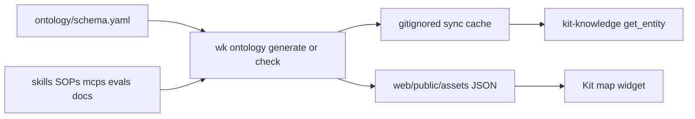

# Author the Waykit map

The [Waykit map](/docs/map) is a live graph of **this kit**: skills, host subagent stubs, SOPs, MCP servers, eval suites, philosophy sections, and public docs. You do not maintain a second catalog. Add or edit the files agents already load; `wk ontology check` fails dangling links; regenerate; the map and kit-knowledge catch up.

This page is how to author that graph. Open the [interactive map](/docs/map) to browse it.

## This is not a product architecture diagram

The map does **not** show your app’s services, Terraform, or org chart. `wk init` in a product repo does not create a team ontology.

| You want | Use |
|----------|-----|
| See how kit skills, SOPs, and MCPs connect | [Waykit map](/docs/map) |
| Change kit phases, skills, or evals and have the graph follow | This page |
| Draw a product or org system | Your product’s own diagrams (for example ArchLens), not this generator |

Forking the kit and keeping the layout below still works. Pointing the generator at an unrelated repo does not.

## What becomes a node

The metamodel is [`schema.yaml`](./schema.yaml). Instances come from the live tree:

| Type | Source | Typical id |
|------|--------|------------|
| Phase | `schema.yaml` → `phaseOrder` | `phase:tdd` |
| Skill | `skills/<name>/SKILL.md` | `skill:agent-tdd` |
| Subagent | `agents/<name>.md` (not `README.md`) | `subagent:agent-tdd` |
| SOP | `SOPs/<name>.md` | `sop:context-budget` |
| McpServer | `mcps/catalog.json` → `servers[].id` | `mcp:memory` |
| EvalSuite | `evals/edd/*.yaml`, `evals/edd/goldens/*.yaml`, and `skills/<name>/evals/eval.json` | `eval:demo` |
| PhilosophySection | `CODING_PHILOSOPHY.md` `## N. Title` headings | `philosophy:8` |
| Doc | `docs/*.md` (top-level files only) | `doc:edd` |
| Handover | `handover/<project>/handover_*.md` | local only |

Handovers are indexed for kit-knowledge. They are stripped from the public map.

## Edges you get without extra YAML

Most links are already in files you edit:

| Relation | How it appears |
|----------|----------------|
| `depends-on` | Skill frontmatter `depends-on:` |
| `uses` | Skill frontmatter `mcp:` (must match a catalog id) |
| `loads` | Markdown link from a skill to `SOPs/…` |
| `references` | Markdown link from a skill, SOP, or subagent stub to `docs/…` |
| `adapts` | Host subagent stub `agents/<name>.md` → matching `skill:<name>` |
| `implements` | SOP body mentions `§N` that exists in philosophy |
| `orders` | Consecutive names in `phaseOrder` |
| `gates` | Suite YAML `ontology.gates`, or a skill-local `evals/eval.json` |
| `for` | Handover filename phase → `phaseOrder` |

Eval gates are explicit. In suite YAML:

```yaml
ontology:
  gates: [mcp:memory, skill:agent-tdd]
```

Ids must already exist (`mcp:…`, `skill:…`, `subagent:…`). `wk ontology check` fails dangling `depends-on`, `mcp`, and subagent→skill refs.

## Add something to the graph

1. Put the file where the table above expects it (new skill folder, `agents/*.md` stub, SOP, catalog server, eval YAML, or top-level doc).
2. Fill skill frontmatter so edges are real: `phase`, `depends-on`, `mcp`, plus SOP/doc links in the body.
3. From a kit checkout:

```bash
wk ontology check
wk ontology generate
```

`check` validates the live-derived index. `generate` writes a gitignored cache to `sync/ontology-index.json` and the site copy to `web/public/assets/ontology-index.json`. Neither file is source of truth; do not commit them.

`wk check` already runs the ontology gate.

## Show it on a docs page

The explorer is a Vite widget, not a generic Markdown feature. In this site’s Markdown:

````markdown
```widget
ontology
```
````

[docs/map.md](../docs/map.md) is that page. The widget fetches `/assets/ontology-index.json` (with `/sync/ontology-index.json` as a local fallback). After `generate`, run `pnpm site:dev` or rebuild Pages so the JSON is on disk.

Deep-link a node with `#ontology:skill%3Aagent-tdd` (URL-encoded id after `ontology:`).

## Customize the metamodel

| Knob | File | What to change |
|------|------|----------------|
| Lifecycle phases | `schema.yaml` → `phaseOrder` | Replace grilling/spec/tdd/… with your phases |
| Memory write allowlist | `schema.yaml` → `memoryEntityTypes` | Add/rename types your agents may store |
| Relations / entity kinds | `schema.yaml` → `types`, `relations` | Extend only if you also teach the generator |
| Skills / SOPs / MCPs | `skills/`, `SOPs/`, `mcps/catalog.json` | Index picks them up automatically |
| Eval→skill/MCP edges | suite YAML `ontology.gates` | Declarative ids like `mcp:memory`, `skill:agent-ship` |
| Philosophy / docs | `CODING_PHILOSOPHY.md`, `docs/*.md` | Linked via `§N` and markdown paths |

Memory writes stay on that allowlist (`GlossaryTerm`, `Slo`, `Preference`, `ProjectFact` today). Kit-static facts belong in files + kit-knowledge, not memory. Decision: [ADR 0005](/docs/ADRs/0005-live-derived-ontology-memory-allowlist).

## Layout the generator expects

These paths are kit conventions (not vendor names):

- `skills/<name>/SKILL.md` (frontmatter: `depends-on`, `mcp`, `phase`)
- `SOPs/*.md`
- `mcps/catalog.json` → `servers[].id`
- `evals/edd/*.yaml`, `evals/edd/goldens/*.yaml` (optional `ontology.gates`)
- `docs/*.md`, `CODING_PHILOSOPHY.md`, `handover/<project>/handover_*.md`

No company or cloud vendor is special-cased in the generator.



Filter, labels, and ring layout: [`wk /src/ontology/graph_view.ts`](../kit/src/ontology/graph_view.ts). D3 adapter: [`web/src/ontology/map.ts`](../web/src/ontology/map.ts).
