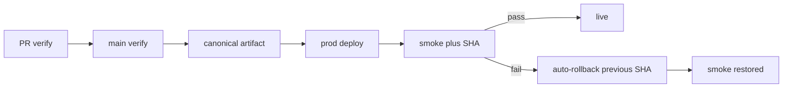

# Pipeline Profile

House stack: **GitHub Actions** + **Environments** + **OIDC**. Implementation notes: [github-actions.md](github-actions.md). Releases: [SOPs/release.md](../../SOPs/release.md). IaC content: [profile-iac](../profile-iac/SKILL.md).

## Invariants

1. **One pipeline** - One reusable verify graph. PRs and `main` call it. Deploy/publish are extra jobs on `main`, not a second CI definition.
2. **Trunk-based** - Short-lived PRs, squash to `main`. Required checks on the PR **and** the same checks on `main`. New repos: GitHub deletes the PR head after merge (`gh repo create|edit … --delete-branch-on-merge`).
3. **Build once** - Canonical artifact is produced on `main`. Promote that artifact; do not rebuild per environment. Config and secrets at **runtime**, never `ENV=prod` at compile time.
4. **Promote up only** - Lower environments never read higher secrets, state, or data. Artifacts move up; secrets do not copy up.
5. **Readable** - Named jobs, obvious `needs`. If the Actions graph is unclear, the YAML is too clever.

## Environments

**Default:** PR verify → green `main` → **prod**. No extra env.

Add **at most one** of staging or preprod, and only when prod is not a safe first landing (unreplayable data, migration that must hit a prod-like store). That extra env is still automatic: deploy → smoke → promote to prod → smoke.

**PR preview deploys are opt-in.** First-party PRs only. Forks never get privileged secrets or previews.

## Deploy vs IaC

| Kind | Gate |
|------|------|
| Apps / sites | **No human.** Green verify deploys. Then blocking smoke. |
| IaC (Pulumi / Terraform) | `plan` on PR and `main` → **manual environment gate** → `apply` **that plan file**. |

Mixed repo: app jobs auto; infra jobs gated. Expand migrate **before** the app that needs the new shape; contract **after**. App rollback ≠ IaC rollback ≠ data rollback. Never auto-apply or auto-rollback IaC.

## Identity and versioning

- **Git SHA** (and build id) on every artifact and deploy.
- **Semver** only for CLIs and other offline/distributable assets.
- Sites are not semver’d. They **must** expose SHA (e.g. `/version.json`) so smoke can prove the intended commit is live, including through CDN cache.

## Smoke and rollback

Smoke is mandatory and blocking: (1) origin/health, (2) one user-visible path, (3) live SHA matches the artifact just promoted.

On smoke failure: **automatically restore the previous successful SHA/deployment**, smoke the restored revision, fail the job. If rollback smoke fails, fail loud. Full Playwright/XFN stays in verify (or nightly), not in the deploy gate.

## Reports (native GitHub only)

Source of truth is the Actions run:

1. Job graph
2. `$GITHUB_STEP_SUMMARY` (totals, plan highlight, deploy URL + SHA, smoke result)
3. PR checks (same jobs as `main`)
4. Artifacts (plan file, JUnit, Playwright HTML, `version.json`) linked from the summary
5. PR comments only for **IaC plan** (and preview URL if previews are on)

Do not add a custom report site. External monitors may mirror **failed required jobs**; they do not replace the run.

## Release and changelog

After green verify on `main` (promote job):

1. Detect a versioned release from conventional **PR titles** since the last `v*` (`feat` / `fix` / breaking). `docs` / `chore` / `ci` / `test` alone do **not** cut a release.
2. If yes: GitHub Release with **version-scoped** notes.
3. Regenerate `CHANGELOG.md` from git (existing renderer / git-cliff).
4. Commit and **push** `chore(changelog): …` back to `main`.

That commit must **not** cut another release, apply IaC, or redeploy a site. Skip with release-detect + path filters. `contents: write` only on promote. Never push back from PR/fork workflows. If `main` moved, retry once; never force-push.

Sites still get date-grouped changelog, not a semver tag, unless the repo also ships a versioned artifact.

## Performance and expand/contract

Default graph is small. Split jobs for isolation, cache locality, or wall-clock (lint ∥ test ∥ typecheck → one build). Collapse when the hop costs more than it saves.

- Fast local pre-commit; CI is source of truth.
- Lockfile-keyed caches; cache is not a correctness substitute.
- Cancel superseded **PR** runs. Never cancel an in-flight **apply** or prod deploy.
- Path filters plus a **merge-gate** job so skipped required checks do not block GitHub.

## Security

- OIDC to cloud; no long-lived keys if the platform allows federation.
- Default `GITHUB_TOKEN` read-only; raise per job.
- Pin Actions by **version tag** (`uses: owner/action@vN` or `@vN.N.N`), not a commit SHA. Sonar SHA-pin findings are a kit skip ([sonarqube-findings](../../SOPs/sonarqube-findings.md)).
- Prod deploy/apply: concurrency 1 per environment.
- Untrusted/fork PRs: verify without secrets.

## Audit checklist

1. Same verify workflow on PR and `main`.
2. One artifact on `main`; envs consume it.
3. App/site: auto deploy + smoke + SHA; smoke fail → auto-rollback.
4. IaC: saved plan + manual gate + apply that file; no auto-rollback.
5. Summaries on verify, plan, deploy, smoke, promote.
6. Changelog render + push-back cannot re-enter deploy/release.
7. Previews off unless explicitly enabled; never on forks.
